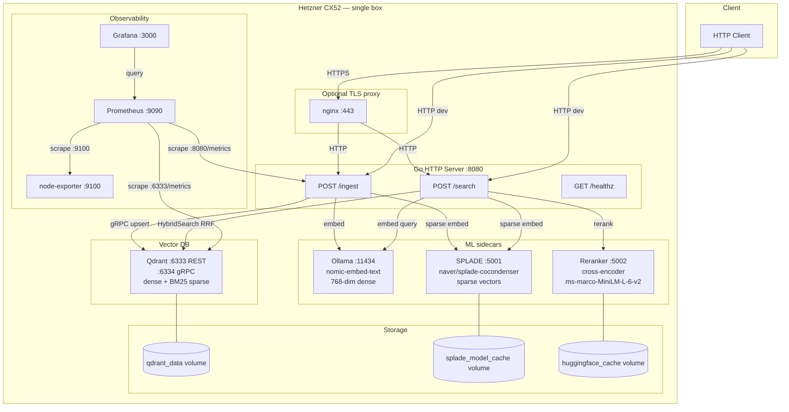

# Tier 1 Infrastructure — Single Box

**Retrieval flow:** query → dense embed (Ollama) + sparse embed (SPLADE) → RRF fusion (Qdrant) → cross-encoder rerank → top-K

**Ingest flow:** markdown → chunk → dense embed (Ollama) + sparse embed (SPLADE) → upsert (Qdrant, SHA dedup)

**Scale trigger:** CPU >70% sustained or SPLADE p99 >500ms → provision ML machine (Tier 2). See `docs/INFRA_SETUP.md`.
