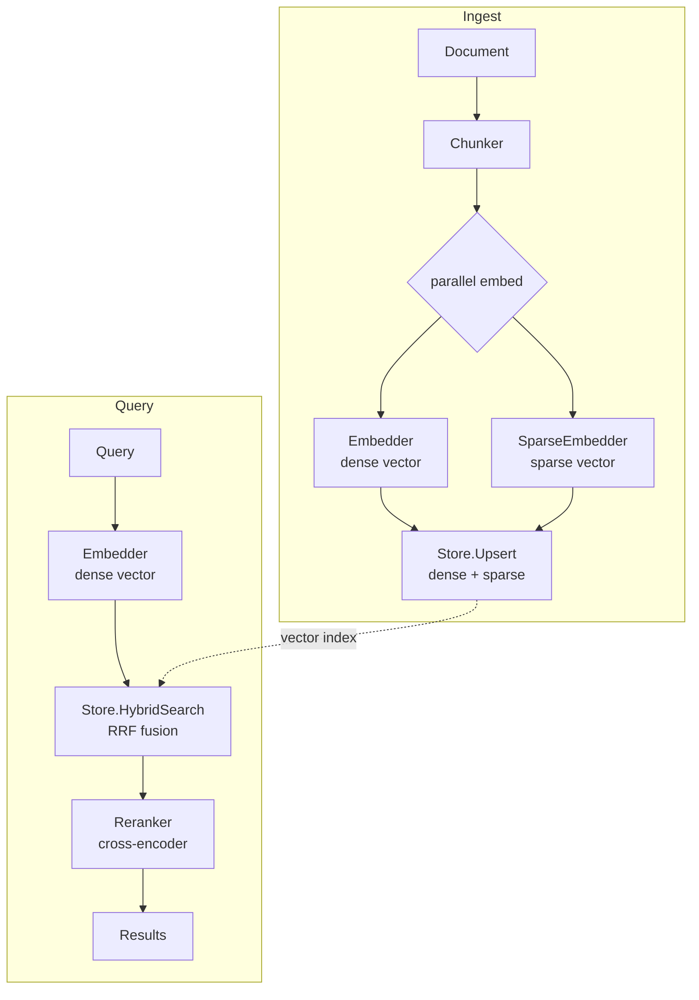

```mermaid
 graph TD
     subgraph Ingest
         A[Document] --> B[Chunker]
         B --> C{parallel embed}
         C --> D[Embedder\ndense vector]
         C --> E[SparseEmbedder\nsparse vector]
         D --> F[Store.Upsert\ndense + sparse]
         E --> F
     end

     subgraph Query
         G[Query] --> H[Embedder\ndense vector]
         H --> I[Store.HybridSearch\nRRF fusion]
         I --> J[Reranker\ncross-encoder]
         J --> K[Results]
     end

     F -.->|vector index| I
```