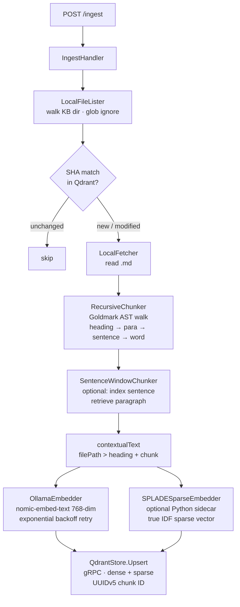
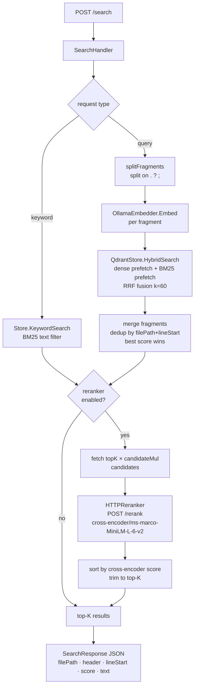
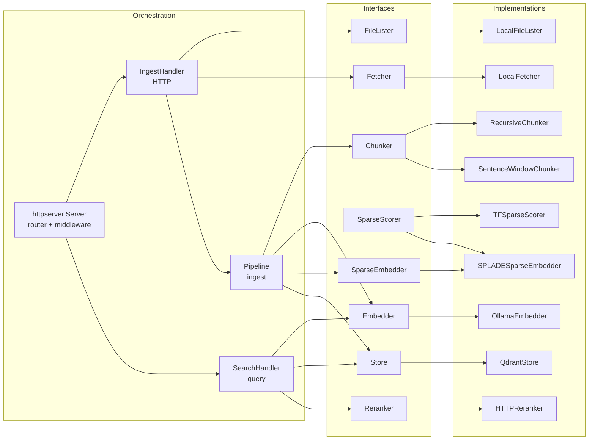
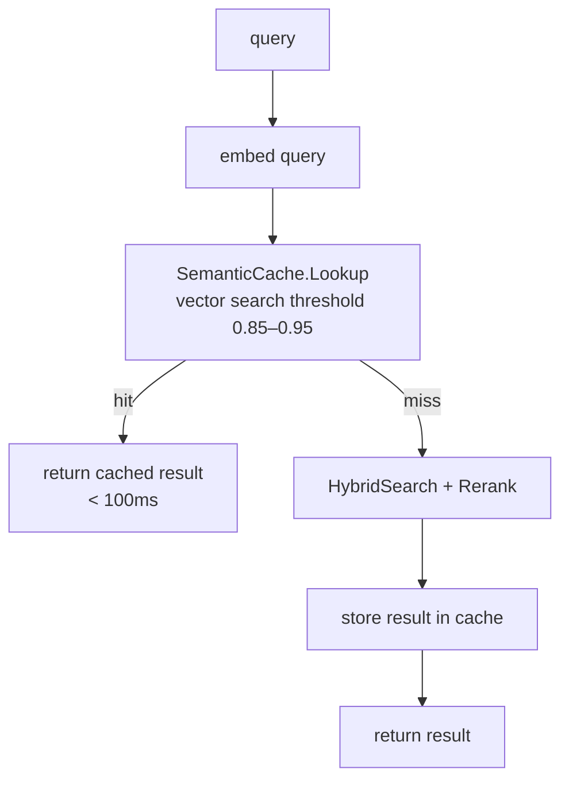

# Nadir — End-to-End Pipeline

## Ingest Pipeline

```mermaid
flowchart TD
    A[POST /ingest] --> B[IngestHandler]
    B --> C[LocalFileLister\nwalk KB dir · glob ignore]
    C --> D{SHA match\nin Qdrant?}
    D -- unchanged --> E[skip]
    D -- new / modified --> F[LocalFetcher\nread .md]
    F --> G[RecursiveChunker\nGoldmark AST walk\nheading → para → sentence → word]
    G --> H[SentenceWindowChunker\noptional: index sentence\nretrieve paragraph]
    H --> I[contextualText\nfilePath > heading + chunk]
    I --> J[OllamaEmbedder\nnomic-embed-text 768-dim\nexponential backoff retry]
    I --> K[SPLADESparseEmbedder\noptional Python sidecar\ntrue IDF sparse vector]
    J --> L[QdrantStore.Upsert\ngRPC · dense + sparse\nUUIDv5 chunk ID]
    K --> L
```

## Query Pipeline

```mermaid
flowchart TD
    A[POST /search] --> B[SearchHandler]
    B --> C{request type}
    C -- keyword --> D[Store.KeywordSearch\nBM25 text filter]
    C -- query --> E[splitFragments\nsplit on . ? ;]
    E --> F[OllamaEmbedder.Embed\nper fragment]
    F --> G[QdrantStore.HybridSearch\ndense prefetch + BM25 prefetch\nRRF fusion k=60]
    G --> H[merge fragments\ndedup by filePath+lineStart\nbest score wins]
    D --> I
    H --> I{reranker\nenabled?}
    I -- no --> J[top-K results]
    I -- yes --> K[fetch topK × candidateMul\ncandidates]
    K --> L[HTTPReranker\nPOST /rerank\ncross-encoder/ms-marco-MiniLM-L-6-v2]
    L --> M[sort by cross-encoder score\ntrim to top-K]
    M --> J
    J --> N[SearchResponse JSON\nfilePath · header · lineStart · score · text]
```

## Component Map

```mermaid
graph LR
    subgraph Interfaces
        CH[Chunker]
        EM[Embedder]
        SE[SparseEmbedder]
        SS[SparseScorer]
        ST[Store]
        FE[Fetcher]
        FL[FileLister]
        RR[Reranker]
    end

    subgraph Implementations
        RC[RecursiveChunker]
        SW[SentenceWindowChunker]
        OE[OllamaEmbedder]
        SP[SPLADESparseEmbedder]
        TF[TFSparseScorer]
        QS[QdrantStore]
        LF[LocalFetcher]
        LL[LocalFileLister]
        HR[HTTPReranker]
    end

    CH --> RC
    CH --> SW
    EM --> OE
    SE --> SP
    SS --> TF
    SS --> SP
    ST --> QS
    FE --> LF
    FL --> LL
    RR --> HR

    subgraph Orchestration
        PL[Pipeline\ningest]
        SH[SearchHandler\nquery]
        IH[IngestHandler\nHTTP]
        HT[httpserver.Server\nrouter + middleware]
    end

    HT --> IH
    HT --> SH
    IH --> FL
    IH --> FE
    IH --> PL
    PL --> CH
    PL --> EM
    PL --> SE
    PL --> ST
    SH --> EM
    SH --> ST
    SH --> RR
```

## Planned: Semantic Cache Layer

```mermaid
flowchart TD
    A[query] --> B[embed query]
    B --> C[SemanticCache.Lookup\nvector search threshold 0.85–0.95]
    C -- hit --> D[return cached result\n< 100ms]
    C -- miss --> E[HybridSearch + Rerank]
    E --> F[store result in cache]
    F --> G[return result]
```
