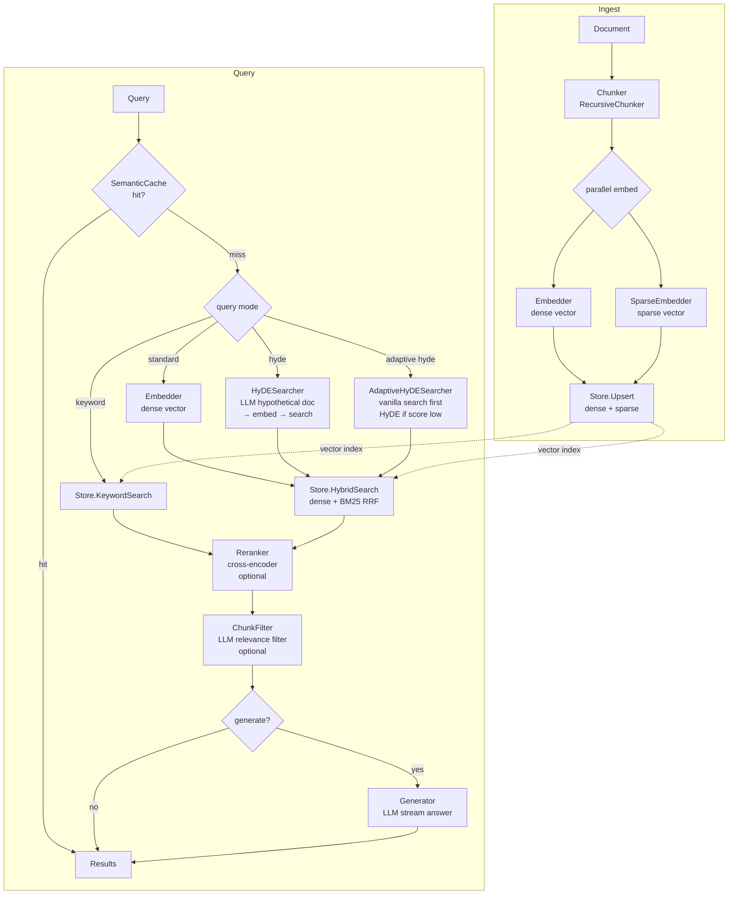

```mermaid
graph TD
    subgraph Ingest
        A[Document] --> B[Chunker\nRecursiveChunker]
        B --> C{parallel embed}
        C --> D[Embedder\ndense vector]
        C --> E[SparseEmbedder\nsparse vector]
        D --> F[Store.Upsert\ndense + sparse]
        E --> F
    end

    subgraph Query
        G[Query] --> SC{SemanticCache\nhit?}
        SC -->|hit| RES[Results]
        SC -->|miss| QM{query mode}

        QM -->|keyword| KS[Store.KeywordSearch]
        QM -->|adaptive hyde| AH[AdaptiveHyDESearcher\nvanilla search first\nHyDE if score low]
        QM -->|hyde| HY[HyDESearcher\nLLM hypothetical doc\n→ embed → search]
        QM -->|standard| EM[Embedder\ndense vector]

        EM --> HS[Store.HybridSearch\ndense + BM25 RRF]
        HY --> HS
        AH --> HS
        KS --> RR

        HS --> RR[Reranker\ncross-encoder\noptional]
        RR --> CF[ChunkFilter\nLLM relevance filter\noptional]
        CF --> GEN{generate?}
        GEN -->|yes| LLM[Generator\nLLM stream answer]
        GEN -->|no| RES
        LLM --> RES
    end

    F -.->|vector index| HS
    F -.->|vector index| KS
```
