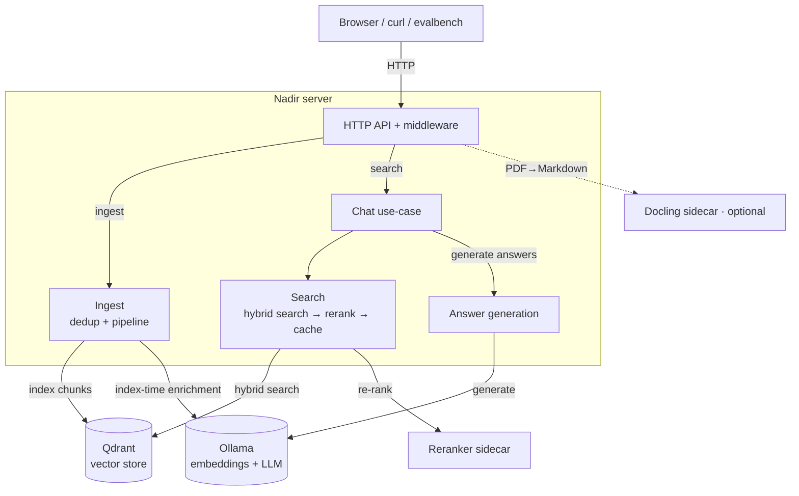

# Architecture — System Topology

Nadir is a self-hosted, markdown-native RAG search engine. A single server
process serves a web dashboard and HTTP API, backed by a vector store, an LLM
service (embeddings + generation + index-time enrichment), and optional Python
sidecars (reranker, PDF converter).

## Topology

## Data flows

**Index path** — submitted documents are deduplicated, chunked, optionally
enriched, embedded, and written to the vector store. A fresh ingest invalidates
the semantic cache.

**Query path** — a question is checked against the semantic cache, embedded,
matched against the store via hybrid search (dense + sparse), optionally
re-ranked, and optionally used to generate an answer. The turn is persisted to
chat history.

**Reset** — dropping indexed data also clears the semantic cache so stale
results can't be served.

## Deployment

Two supported topologies: a local dev stack (server on the host, dependencies
in containers) and a full Docker Compose stack. The only config-driven
variation is which optional features are enabled (reranker, answer generation,
semantic cache, enrichment) — none of which change the overall topology.

---

## Component approaches

### Server — single Go binary

One Go binary: HTTP API, chat use-case, search and ingest pipelines, and the
composition root that wires everything together. No microservices.

### Vector store — Qdrant

All state lives in Qdrant: indexed chunks, semantic cache, and chat history in
separate collections. Self-hosted, runs on modest hardware, and supports dense
+ sparse vectors with server-side fusion in one query. One store means no extra
infrastructure.

### LLM service — Ollama

One local service provides embeddings, answer generation, and enrichment.
Fully private — documents never leave the machine — and offline-capable.

### Ingest & chunking — markdown-aware recursive chunker

Documents are deduplicated by content hash, then split into sections and into
overlapping chunks at paragraph/sentence boundaries (hard character split as
fallback). Chunking by markdown structure keeps chunks anchored to their
heading, so each chunk is self-contained and useful for filtering and
citations.

### Embeddings — task-prefixed embeddings

Chunks are embedded with `nomic-embed-text`; document chunks get a document
prefix at ingest and queries get a query prefix at search time. The model
distinguishes "document" from "search query" representations, improving
retrieval over a shared space.

### Retrieval — hybrid search (dense + sparse, fused with RRF)

Queries run two legs: dense vector search for semantics and BM25 sparse search
for exact terms. Both fetch extra candidates and are fused server-side with
RRF. Dense handles paraphrase; sparse catches exact terms, names, and rare
notation. RRF avoids calibrating the two legs' incompatible scores.

### Re-ranking — cross-encoder sidecar

Top candidates are re-scored by a cross-encoder that scores query–passage pairs
jointly. More accurate relevance than cosine similarity. A separate Python
sidecar because the models live in the Python ecosystem and are swappable
without touching the Go server. Only a small candidate set is reranked, so
latency stays low.

### Semantic cache — query-level cache in the vector store

Near-repeat questions are matched by embedding the query against a cache
collection with a similarity threshold; hits skip re-retrieval. Semantic (not
exact) caching catches rephrased questions. Lives in the vector store, and is
cleared on ingest and on full reset.

### Answer generation — grounded RAG with lost-in-the-middle ordering

Chunks are assembled into a prompt that restricts answers to the given context
with source citations. Best chunks are placed in the middle (LLMs attend most
there), and the context is fit to a token budget. Grounding keeps answers
faithful and attributable to indexed documents.

### Chat history — sessions and turns in the vector store

Each turn (query, chunks, answer, errors) is persisted per session, detached
from the response path. Enables conversation continuity and a reviewable trace;
persistence is best-effort and never blocks the response.

### Index-time enrichment — hypothetical questions + contextual intros

Optional ingest-time passes: HyPE generates hypothetical user questions per
chunk; contextual writes a short situational intro per chunk. Both are
one-time costs per chunk, off the query path. HyPE closes the gap between how
documents read and how users ask; contextual intros keep out-of-context chunks
understandable to the embedding model and reader.

### Docling sidecar — PDF to Markdown

A Python service converts PDFs to Markdown so they flow through the same ingest
pipeline as native markdown. PDF extraction needs the Python ecosystem, which
isn't vendored into the Go binary; the sidecar is optional so the core runs
with no Python for markdown-only sources.