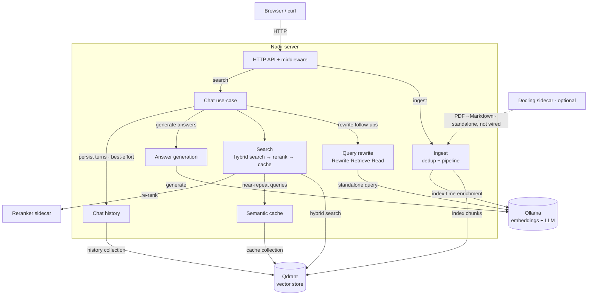
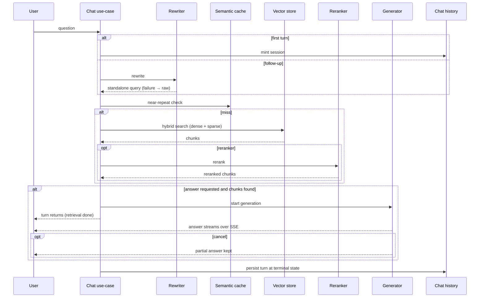

# Nadir Architecture

Nadir is a self-hosted, markdown-native RAG search engine. A single server
process serves a web dashboard and HTTP API, backed by a vector store, an LLM
service (embeddings + generation + index-time enrichment + query rewriting),
and optional Python sidecars (reranker, PDF converter).

## Topology

## Data flows

**Index path** — submitted documents are deduplicated, chunked, optionally
enriched, embedded, and written to the vector store. A fresh ingest invalidates
the semantic cache.

**Query path** — one chat turn (see Chat System below): mint session, rewrite
follow-ups, cache-checked hybrid search, optional streaming answer; the turn
is persisted at its terminal state.

**Reset** — dropping indexed data also clears the semantic cache so stale
results can't be served.

---

## Chat System

A conversation is a session of turns. One turn is a question, its retrieval
trace, and optionally a streaming answer. The chat use-case owns the whole
lifecycle — it mints sessions, rewrites follow-ups, retrieves context,
starts generation, and persists the finished turn. HTTP requests only start
turns and observe them.

### Session and rewriting

The first turn mints a session; follow-ups are rewritten into standalone
queries against recent turns (Rewrite-Retrieve-Read) — best-effort: with no
prior turns or on failure, the raw question is searched and stays the turn's
record.

### Retrieval

Cache hits skip retrieval; misses split into sentence fragments, each run
through hybrid search (dense + sparse, fused with RRF), merged with optional
rerank — no chunks, no generation.

### Streaming generation

The turn request returns once retrieval is done; the answer streams from a
domain-owned event log over SSE — late subscribers replay from their cursor,
disconnects don't kill generation, cancellation keeps the partial answer,
and terminal states are persisted.

### Persistence

Turns persist to chat history best-effort and detached from the response
path — a slow store never blocks the answer — and with history, rewriting,
or generation disabled, a turn degrades to plain search.

## Deployment

Two supported topologies:

- **Local dev** — server runs on the host against `config/config.yaml`
  (localhost addresses); only Qdrant runs in Docker. The reranker sidecar
  runs from the repo `venv/` on the host GPU (like Ollama). Started by
  `./scripts/local.sh`.
- **Docker Compose** — everything in containers; env vars override the
  config: Qdrant at `qdrant:6334`, reranker at `reranker:5002`, Ollama at
  `host.docker.internal:11434`. GPU-first: the build bakes a CUDA-torch
  reranker image (`RERANKER_GPU=0` switches to the CPU build) and the
  sidecar reserves the host GPU.

---

## Component Design

### Server

One Go binary: HTTP API, chat use-case, search and ingest pipelines, and the
composition root that wires everything together. No microservices.

### Dashboard — embedded htmx/Alpine chat UI

An htmx + Alpine chat UI: templates in `dashboard/` are embedded via
`go:embed` and parsed once at startup (no markup in Go source); it calls the
same HTTP API as curl and receives answers over plain EventSource (SSE).

### Failure handling — retries and best-effort

Retries live in the ingest pipeline (embed calls, with backoff); the
embedder and store never retry. Query-time dependencies are best-effort — a
reranker, rewriter, cache, or history failure degrades the result or skips
persistence, never failing the turn; generation errors surface as typed
stream events.

### Vector store — Qdrant

All state lives in Qdrant (indexed chunks, semantic cache, chat history —
separate collections): self-hosted, dense + sparse with server-side fusion
in one query, no extra infrastructure.

### LLM service — Ollama

One local service provides embeddings, answer generation, enrichment, and
query rewriting — fully private and offline-capable.

### Ingest & chunking — markdown-aware recursive chunker

Documents are SHA-256-deduped and split into overlapping chunks anchored to
markdown headings (paragraph/sentence boundaries, hard character split as
fallback). Sources are `source.paths` directories plus uploaded `.md` files,
processed concurrently (8 workers); chunk IDs are deterministic (UUIDv5 over
`filePath:lineStart:chunkIndex`, HyPE siblings append `:hype:<n>`), so
re-ingesting upserts in place.

### Embeddings — task-prefixed embeddings

Chunks are embedded with `nomic-embed-text`, with a document prefix at
ingest and a query prefix at search time, so the model distinguishes
document from search-query representations.

### Retrieval — hybrid search (dense + sparse, fused with RRF)

Queries split into sentence fragments; each runs dense (semantics) and BM25
sparse (exact terms) legs in parallel, fused server-side with RRF to avoid
calibrating incompatible scores, then merged by best score with a per-file
cap so one document can't crowd out others.

### Re-ranking — cross-encoder sidecar

Top candidates are re-scored by a swappable cross-encoder sidecar (Python
ecosystem, joint query–passage scoring); only a small candidate set is
reranked, so latency stays low.

### Semantic cache — query-level cache in the vector store

Near-repeat questions hit a similarity-thresholded cache collection in the
vector store, skipping re-retrieval; it is cleared on ingest and full reset.

### Query rewriting — conversational follow-ups to standalone queries

Follow-up turns are rewritten into standalone search queries over Ollama
(Rewrite-Retrieve-Read, feature-flagged, gated on chat history);
best-effort — a rewrite failure falls back to the raw query.

### Answer generation — grounded RAG with lost-in-the-middle ordering

Chunks are assembled into a citation-constrained prompt with the best chunks
in the middle, fit to a token budget, so answers stay faithful and
attributable to indexed documents.

### Chat history — sessions and turns in the vector store

Each turn (query, rewritten query, chunks, prompt, answer, errors, timing)
is persisted per session, enabling conversation continuity and a reviewable
trace; sessions are listed in the sidebar and can be deleted individually.

### Index-time enrichment — hypothetical questions + contextual intros

Optional ingest-time passes over Ollama: HyPE generates hypothetical user
questions, contextual writes a short situational intro — both one-time per
chunk and off the query path, closing the gap between how documents read
and how users ask.

### Docling sidecar — PDF to Markdown

A Python service converts PDFs to Markdown so they can be ingested (the
Python ecosystem isn't vendored into the Go binary); currently a standalone
script, not wired into the server.