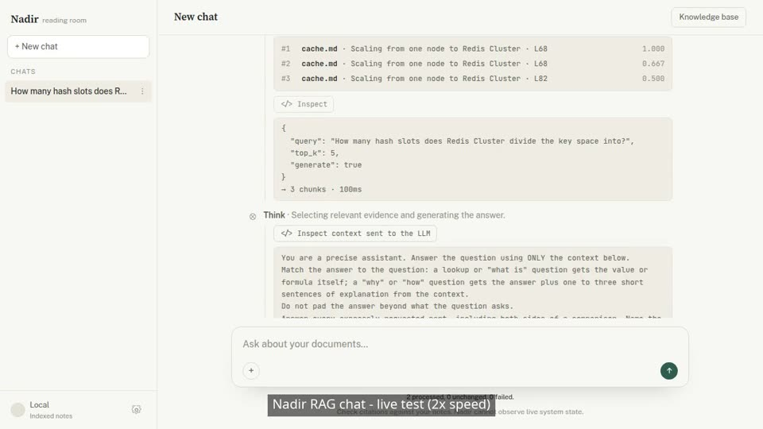

# Nadir: Retrieval Augmented Genration

RAG as a service with chat-based conversation, using an LLM as the answer generator.

## Demo

[](media/rag-chat-demo.mp4)

A 60-second recording at 2× speed (click the picture to play): delete all chats,
import two Markdown files, ask a question, open **Inspect** and **Inspect context
sent to the LLM**, click a citation, ask a follow-up, then ask a question the
documents cannot answer.

## Algorithms and approach

```text
Documents -> Markdown AST -> Chunk document -> Embed (dense vector) + word counts (BM25 sparse vector) -> Qdrant

Question -> Query rewrite (optional) -+-> Embed question  -> Dense search (cosine)  -+
                                      |                                             +-> RRF fusion
                                      +-> Question words -> Keyword search (BM25) --+
                                                                                    |
                                                                       Reranker model (optional)
                                                                                    |
                                                                       Language model answer + source references
```

1. **Parse:** Goldmark parses each Markdown document into an abstract syntax tree (AST), which structures the text into headings, lists and text blocks.
2. **Chunk:** The text is split with recursive chunking or sentence-window chunking.
3. **Embed and store:** An embedding model turns each chunk into a vector, and the vector is stored in Qdrant.
4. **Rewrite (optional):** The user's question is rewritten before retrieval.
5. **Retrieve:** Hybrid search combines vector search with **BM25 keyword search**, and **Reciprocal Rank Fusion (RRF)** merges the two rankings.
6. **Rerank (optional):** After the top-k results are fetched, a reranker model reorders them from the highest to the lowest relevance score.
7. **Generate:** The retrieved text is passed as context to the LLM, which generates the answer.

## Chat Architecuture

A POST request rewrites the question, searches and returns the sources. A
background worker then runs the language model and writes the answer to an event
log. The browser watches that log over Server-Sent Events (SSE), so a dropped
connection does not stop the answer.

```text
Browser                         Chat service                                Adapters
   |  POST question                  |
   |-------------------------------->|  edit or new session? -> prune / create ----> History store
   |                                 |  rewrite follow-up (uses past turns) -------> Language model
   |                                 |  search (hybrid, cache) -------------------> Qdrant
   |                                 |  build prompt within the token budget
   |                                 |  shortcut answers (no model call) ----+
   |                                 |  register turn in broker              |
   |<--- sources + turn id ----------|  start worker (detached context)      |
   |                                 |                                       |
   |  GET stream (Last-Event-ID)     |        Worker (one per turn)          |
   |-------------------------------->|          call language model -------------> Language model
   |                                 |          tokens -> citation filter    |
   |<=== SSE: token, token, done ====|<-------  append to event log (seq 1..n)
   |                                 |          save finished turn ---------------> History store
   |  drop connection                |
   |  reconnect from last seq ======>|  replay log after seq, then go live
   |  POST cancel ------------------>|  stop worker; keep and save partial answer
```

Patterns used:

- **Rewrite-Retrieve-Read:** follow-up questions are rewritten into standalone
  search queries before retrieval, then the answer is read from the found text.
- **Background worker with a publish/subscribe event log:** the worker is the
  only publisher; any number of connections subscribe. Each event has a
  sequence number, so a reconnecting browser resumes with `Last-Event-ID`
  instead of losing text. A subscriber that falls behind is closed and replays.
- **Ports and adapters (hexagonal):** the chat service depends on small
  interfaces for search, generation and history. Qdrant, the language model
  server and HTTP are adapters behind them.
- **Optimistic concurrency:** editing or deleting a conversation while a turn
  is starting or running is detected with a version token, and the turn stops
  instead of writing into changed history.

## Evaluation with Ragas

Ragas checks whether answers agree with the source text and expected answers,
and whether search finds useful text. Scores range from 0 to 1; higher is better.

### October 9, 2026 result

| Score | What it measures | Result |
|---|---|---:|
| Faithfulness | Answer claims supported by the text shown to the model | 0.74 |
| Factual correctness (F1) | Agreement with the expected answer, counting extra and missing facts | 0.63 |
| Context precision | Useful text appears near the top of the search results | 0.96 |
| Context recall | How much of the expected answer is supported by the found text | 0.90 |

- **Good:** context precision (0.96) and context recall (0.90) show that search
  finds the right text and ranks it near the top.
- **Treat as a floor:** faithfulness (0.74) and factual correctness (0.63) were
  graded by a small local model. It failed to score some answers and marked
  correct answers as 0. Of five low-scoring answers checked by hand, four were
  correct, so the real quality is likely higher than shown.
- **Weak:** one question that the documents do not answer (distractor-05) got a
  genuinely poor answer.
- **Limit:** the expected answers were written by the author and not reviewed by
  another person. See the [evaluation log](evaluation-log.md).

### October 8, 2026

50 answerable questions, top 10 results, at most 3 chunks per
file, with and without fetching 3 times as many candidates before that limit.

| Setting | Hit@1 | Hit@3 | Recall@10 | MRR | Results returned |
|---|---:|---:|---:|---:|---:|
| 3× candidates (current) | 0.78 | 0.94 | 0.81 | 0.847 | 8.6 |
| 1× candidates | 0.78 | 0.94 | 0.81 | 0.843 | 5.2 |
| 3× candidates, 5 chunks per file | 0.78 | 0.94 | 0.86 | 0.852 | 9.4 |

- **Good:** Hit@3 (0.94) means the right document is almost always in the top 3.
  Hit@1 (0.78) means the first result is right about four times in five, with the
  reranker off.
- **Weak:** Recall@10 (0.81) is held down by questions that need several chunks
  from one file, because at most 3 chunks per file are returned. Allowing 5 raises
  it to 0.86.
- **No gain from 3× candidates:** MRR differs by 0.004, within the 0.003 run-to-run
  noise. The setting fills the result list (8.6 results instead of 5.2) but does not
  improve ranking.
- **Unanswerable questions:** results for questions the documents cannot answer
  still score up to 0.83, so a search score alone cannot tell the system to say
  "no answer".

## Benchmark

### October 8, 2026

13 documents, 60 seconds per level after a discarded 20-second warm-up,
no failed requests. Cells show 1 / 2 / 4 simultaneous users.

| Test | Median time | p95 | Tasks/s |
|---|---|---|---|
| Search only | 0.10 / 0.11 / 0.13 s | 0.11 / 0.12 / 0.17 s | 0.87 / 1.8 / 3.5 |
| Cache reuse | 0.20 / 0.20 / 0.23 s | 0.22 / 0.23 / 0.27 s | 0.80 / 1.6 / 3.2 |
| Chat | 8.1 / 8.1 / 11 s | 8.1 / 9.5 / 13 s | 0.12 / 0.22 / 0.33 |
| Chat, first text | 6.9 / 6.9 / 9.5 s | 6.9 / 8.3 / 12 s | — |
| Follow-up | 15 / 15 / 17 s | 15 / 15 / 22 s | — |

- **Fast:** search (0.10 to 0.13 s) and cache reuse (about 0.2 s) barely slow down
  as users are added.
- **Slow:** chat takes 8 to 11 s and the first text appears after 7 to 9.5 s,
  because the language model writes the answer. Four times the users gave only
  2.75 times the throughput, so answer generation is the bottleneck.
- **Follow-ups** take 15 to 17 s because the question is rewritten before search.
  Sources are sent first, so users see them before the answer starts.
- **Limit:** this is a small test (13 documents, 1 to 4 users). It shows relative
  cost, not production capacity.

## Models used

Answers, follow-up rewriting and grading use Qwen 3.5 4B; embeddings use
EmbeddingGemma 300M; the optional reranker is BGE reranker v2-M3 (off by
default). Ragas 0.4.3 and Locust 2.46.7 produced the results above.

## References

- [RRF paper](https://plg.uwaterloo.ca/~gvcormac/cormacksigir09-rrf.pdf).
- [Qdrant: Combining search methods](https://qdrant.tech/documentation/search/hybrid-queries/).
- [Query rewriting paper](https://arxiv.org/abs/2305.14283).
- [Ragas: Scoring methods](https://docs.ragas.io/en/stable/concepts/metrics/available_metrics/).
- [Locust: Performance testing](https://docs.locust.io/en/stable/what-is-locust.html).
