# Nadir RFCs

Status: draft · Applies to: `nadir` semantic document search engine

This document records the architecture of nadir as a set of Requests for
Comments. Each RFC describes one subsystem: the problem it solves, the chosen
design, the alternatives considered, and the open questions. Diagrams are
Mermaid. Headers are intentionally unnumbered so sections can be added,
removed, and reordered without churn.

---

## System Overview

Nadir is a local-first RAG (retrieval-augmented generation) engine. It ingests
markdown documents, chunks and embeds them, stores the results in Qdrant as
hybrid dense + BM25 points, and serves chat-style question answering over HTTP
with optional cross-encoder reranking, semantic caching, and answer generation
via Ollama.

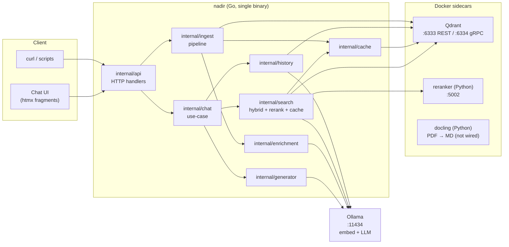

Design constants that shape everything downstream:

- One Go binary (`cmd/server`); wiring lives in `internal/server/server.go`,
  which acts as the composition root.
- Qdrant is the only durable store. Three collections share one gRPC
  connection: `documents_chunks`, `search_cache`, `chat_history`.
- All model calls (embeddings, LLM answers, enrichment) go to Ollama.
- Domain packages (`internal/*` outside `api/server/middleware`) must not
  import transport or wiring packages.
- Every auxiliary feature (reranker, generator, cache, history, enrichment)
  is best-effort and config-gated: the system degrades to plain hybrid search
  when any of them is disabled or unreachable.

---

## Request Lifecycle and Middleware

### Motivation

A single HTTP surface serves the JSON API, the htmx chat UI, and ops
endpoints. Cross-cutting concerns must be applied uniformly and must not leak
into domain packages.

### Design

Middleware is registered outermost-first in `internal/server/server.go`:

`Recovery → RequestID → Timeout → RequestLog → Metrics`

Routes (see `internal/api/router.go`):

| Method | Route | Purpose |
|--------|-------|---------|
| POST | `/ingest` | multipart `.md` upload → chunk/embed/upsert |
| POST | `/store/reset` | drop + recreate collection, clear cache |
| GET | `/retrieval` | chat page shell (htmx) |
| POST | `/retrieval/search` | one chat turn (search ± generate ± persist) |
| GET | `/settings` | read-only view of effective config |
| GET | `/history/sessions` | sidebar session list |
| GET/DELETE | `/history/sessions/:id` | replay / delete one conversation |
| GET | `/healthz` | liveness |

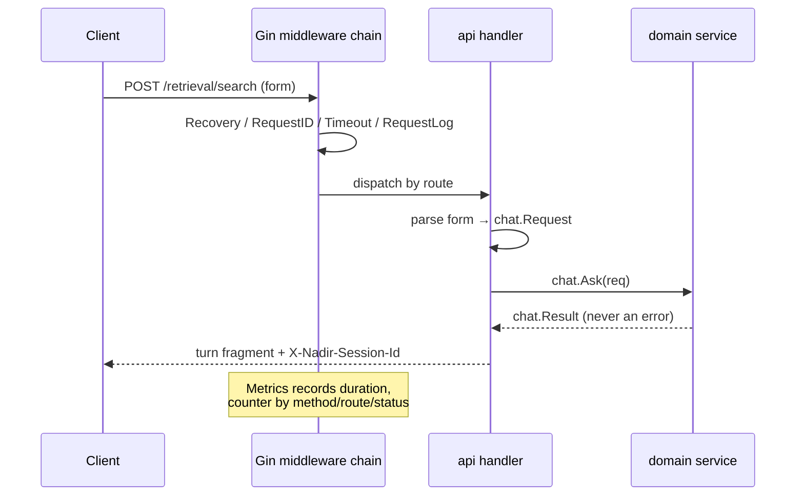

Handlers are pure HTTP: parse request, invoke a domain use-case, map the
result to a view, render. No markup lives in Go source; templates are embedded
from `dashboard/` and parsed once at startup.

### Open questions

- `Metrics()` middleware is currently a stub — the Prometheus registry is
  constructed but no recording happens.
- Cancellation semantics: the middleware timeout bounds each request, but
  detached persistence (below) deliberately outlives it via
  `context.WithoutCancel`.

---

## Ingest Pipeline

### Motivation

Users upload markdown files through the chat UI or `curl -F`. Ingestion must
be idempotent, crash-tolerant, and safe to re-run on every server start
(`./scripts/local.sh` re-ingests automatically).

### Design

`internal/ingest` runs a worker pool (8 workers) over uploaded files:

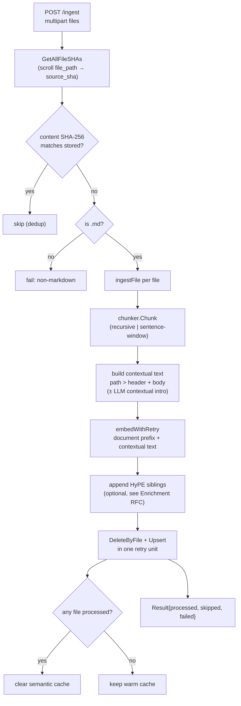

Key decisions:

- **SHA dedup is content-based**, not path-based. The map from
  `GetAllFileSHAs` keys on `file_path`, and a file whose bytes hash to the
  stored SHA is skipped. Re-uploading identical content is free.
- **Delete + upsert share one retry.** Chunk IDs derive from
  `filePath:lineStart:chunkIndex` (UUIDv5), so edits that shift line
  boundaries produce new IDs and orphaned old points unless deleted first.
  Wrapping delete and upsert in a single `backoff.RetryNotify` prevents the
  intermediate state where a file has zero indexed chunks.
- **Retry lives in the pipeline, never in Embedder/Store.** The backoff policy
  (attempts, initial/max interval, multiplier) is ingest config; domain
  clients stay single-shot.
- **Cache invalidation is conditional.** The semantic cache is cleared only
  when at least one file was actually processed — an all-skipped sweep has
  nothing stale to invalidate.
- **Batched embedding preferred.** `embedWithRetry` type-asserts
  `BatchEmbedder` and uses one `EmbedBatch` call per file; the loop fallback
  is per-input with per-input retry.

### Alternatives considered

- *File-watching incremental ingest* — rejected for now; explicit upload +
  start-time sweep is simpler and covers the primary workflow.
- *Point-level diffing instead of delete-by-file* — rejected: ID instability
  under edits makes diff sets hard to reason about; delete-by-file sweeps
  HyPE siblings for free.

---

## Chunking

### Motivation

Retrieval quality depends on chunk granularity. Two strategies are supported
behind one interface so they are swappable per deployment without touching
callers.

### Design

`internal/chunker` exposes:

```go
type Chunker interface {
    Chunk(text string, filePath string) ([]Chunk, error)
    ContextualText(c Chunk) string // "path > header\nbody"
}
```

Providers:

- **recursive** (default) — size/overlap based (`chunk_size: 512`,
  `chunk_overlap: 64`), splitting on structural boundaries.
- **sentence-window** — each sentence becomes an anchor with `window_size`
  sentences of context before and after, stored as `WindowText`.

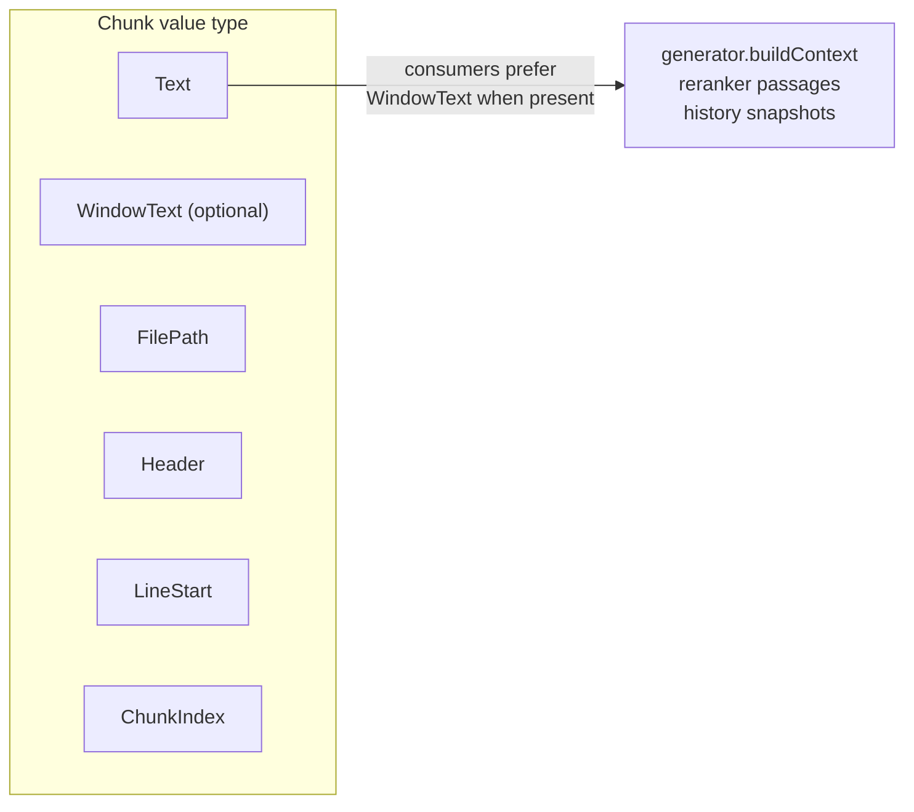

`ContextualText` is the shared "identity prefix" format
(`filePath > header\nbody`). Both retrieval legs index the same string, which
keeps dense and BM25 rankings comparable (see Hybrid Retrieval RFC).

### Open questions

- Sentence-window provider exists but has no A/B numbers against recursive on
  the current golden set; the eval harness should compare them before any
  default change.

---

## Embedding

### Motivation

A single embedding model (default `nomic-embed-text`, 768 dims) must serve
both index-time and query-time, while remaining swappable without code
changes.

### Design

`internal/embedder` defines two interfaces:

```go
type Embedder interface {
    Embed(ctx context.Context, text string) ([]float32, error)
    Dimensions() int
}
type BatchEmbedder interface {
    Embedder
    EmbedBatch(ctx context.Context, texts []string) ([][]float32, error)
}
```

Task prefixes are applied **at call sites**, not inside the embedder:

| Prefix | Config | Applied by |
|--------|--------|-----------|
| `search_document: ` | `embedder.document_prefix` | ingest, before embedding chunk/contextual text and HyPE questions |
| `search_query: ` | `embedder.query_prefix` | search, before embedding query fragments |

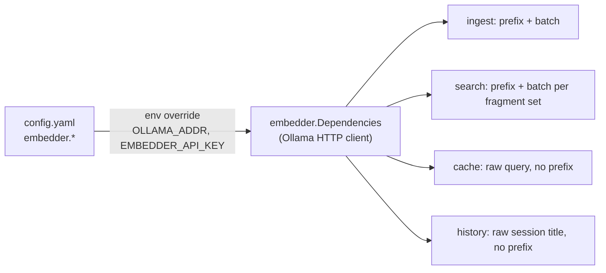

Consequences:

- Changing either prefix **requires a reindex** — the stored dense vectors
  encode it.
- The semantic cache and history intentionally embed **unprefixed** text;
  they compare like-with-like within their own collections and don't care
  about document/query task split.

---

## Hybrid Retrieval

### Motivation

Pure dense retrieval misses exact identifiers and symbols; pure BM25 misses
paraphrases. The system fuses both, and multi-sentence questions deserve
per-sentence attention.

### Design

`internal/search` implements the top-level `Search.Query` entry point:

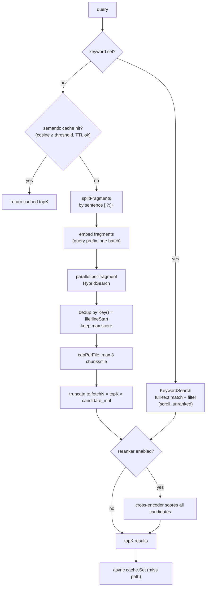

Inside `internal/store`, `HybridSearch` executes as **one Qdrant query** with
two server-side prefetches fused by RRF:

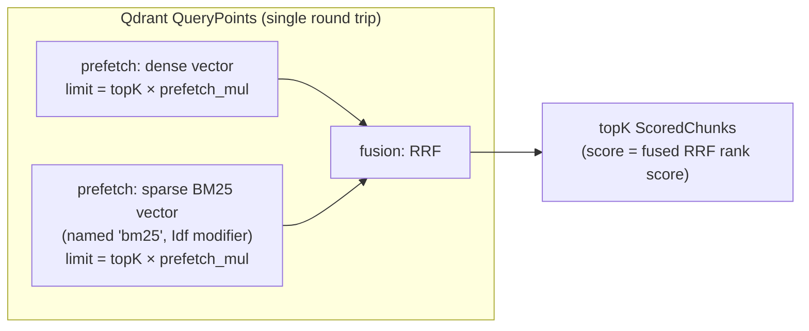

Decisions and rationale:

- **Server-side RRF, not Go-side.** Fusion happens in Qdrant in one round
  trip; the code never re-implements RRF math.
- **IDF-weighted sparse leg.** The sparse vector is created with Qdrant's
  `Idf` modifier over raw term counts, giving a real BM25-style ranking
  rather than a text filter.
- **Both legs index identical context.** Ingest sets `SparseText` to the same
  `path > header\nbody` string the dense leg embeds (minus the task prefix),
  so neither leg sees different context.
- **Fragment fan-out with dedup.** Each sentence of a multi-sentence query is
  searched concurrently; results merge by `Key()` keeping the best score.
  Per-file capping (max 3) keeps one large document from crowding out
  context diversity.
- **Candidate over-fetch.** When the reranker is on, search fetches
  `topK × candidate_mul` candidates so the cross-encoder has headroom to
  reorder; `topK × prefetch_mul` at the store level widens each fusion leg.
- **Cache is bypassed when generating.** `skipCache = generate` in the chat
  path: a fresh answer requires fresh retrieval, not a cached chunk list.

### Alternatives considered

- *HyDE / multi-query expansion* — rejected (documented in TODO.md): tends to
  underperform vanilla hybrid retrieval on precise numeric/entity queries;
  sentence-splitting already captures part of the benefit.
- *Go-side two-query fusion* — rejected: doubles round trips and duplicates
  ranking logic the server already implements.

---

## Reranking

### Motivation

RRF fusion ranks by consensus, not by direct query–passage interaction. A
cross-encoder can reorder fused candidates for a large MRR/nDCG gain
(measured: 0.707 → 0.824 MRR@10 on the 34-query golden set), at a
significant CPU latency cost (~3.2s p50 for bge-reranker-v2-m3 on CPU).

### Design

`internal/reranker` is a thin HTTP client to a Python sidecar (FastAPI,
`:5002`) hosting a swappable cross-encoder (`reranker.model`, default
`BAAI/bge-reranker-v2-m3`).

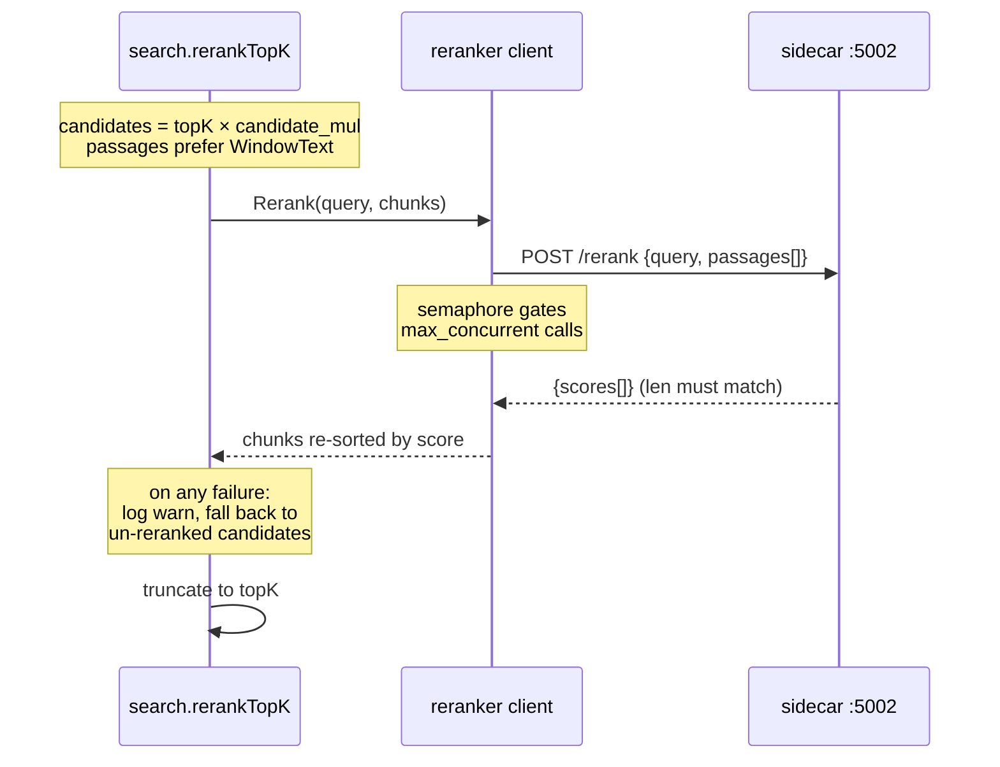

- **Graceful degradation:** any reranker failure (network, status, score
  count mismatch) returns the original candidates un-truncated, so
  retrieval never fails because of the reranker.
- **Concurrency-limited:** a semaphore (`max_concurrent`, default 10) bounds
  concurrent sidecar calls; context cancellation abandons the wait and
  falls back.
- **Model swap is config-only:** `RERANKER_MODEL` env propagates through
  docker-compose to the sidecar; reverting to the tiny
  `ms-marco-MiniLM-L-6-v2` baseline is a config change plus sidecar restart.

### Open questions

- fp32 CPU latency (~3.2s p50) exceeds the 1–2s budget. Options on the
  roadmap: ONNX/int8-quantized bge-reranker-v2-m3, or the smaller
  bge-reranker-base. Should be measured with `cmd/evalbench` before
  switching.

---

## Semantic Cache

### Motivation

Repeated or near-duplicate questions should not re-run the full
embed → hybrid → rerank pipeline (or regenerate an LLM answer), given
Qdrant is already deployed and embedding is cheap.

### Design

`internal/cache` stores whole result lists as JSON in a dedicated Qdrant
collection (`search_cache`), keyed by the embedding of the raw query:

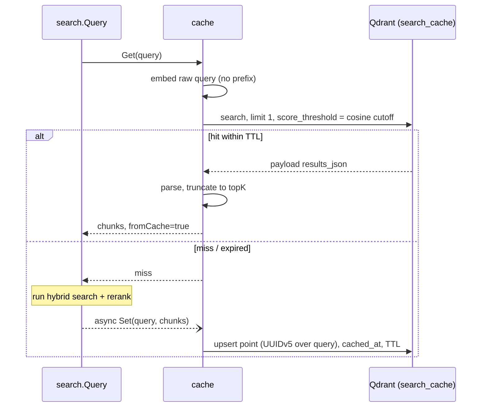

- **Point ID is deterministic:** UUIDv5 over the query text, so repeated
  `Set` overwrites rather than accumulating.
- **TTL enforced read-side:** expired entries are treated as misses
  (`cached_at` payload, checked on read); TTL 0 disables expiry.
- **Invalidation is composite and centralized:**
  - ingest clears the cache when any file was actually processed;
  - `POST /store/reset` must drop the document collection *and* clear the
    cache — enforced once at the composition root via the
    `cacheInvalidatingStore` decorator so every caller gets it for free.
- **Best-effort everywhere:** cache errors degrade to a normal search; cache
  writes happen in a detached goroutine and never block the response.

### Alternatives considered

- *Exact-match cache* — rejected: near-duplicate phrasing is common in chat;
  cosine-threshold matching captures it for one extra embed call.
- *Dedicated cache infra (Redis + vector extension)* — rejected: reusing
  Qdrant adds zero infra for this scale.

---

## Chat Use-Case and History

### Motivation

The HTTP handlers previously orchestrated retrieval, generation, and
persistence inline. The chat turn is a real use-case with its own rules:
sessions are minted server-side, persistence is best-effort, and a turn must
always render — even when its stages fail.

### Design

`internal/chat.Ask` runs one full turn:

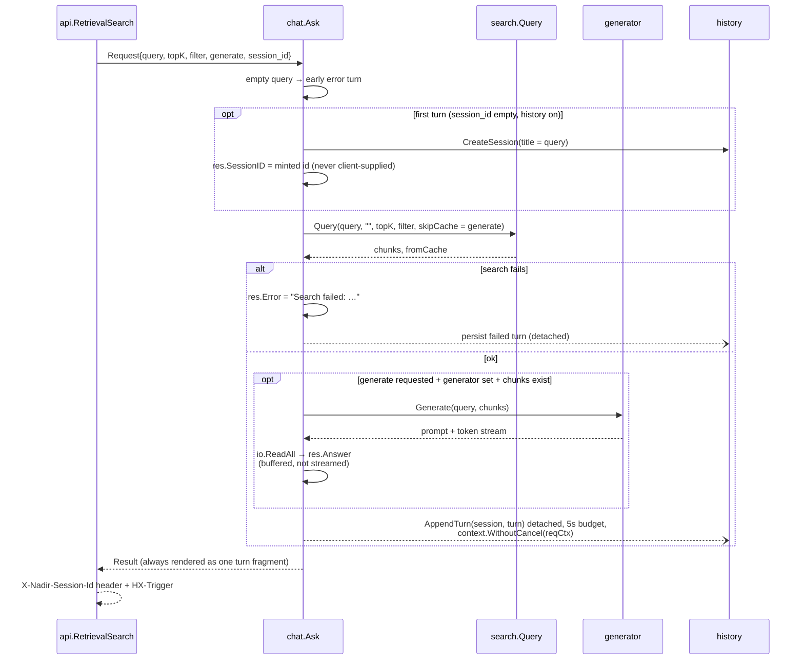

Rules encoded here:

- **`Ask` never returns an error.** Stage failures land in `Result.Error`
  (search) or `Result.GenerateError` (generation) so the UI can always render
  a turn, including the failure itself.
- **Sessions are minted, not accepted.** An empty `SessionID` on the first
  turn causes server-side creation; clients can't spoof or collide ids. The
  minted id is returned to the composer via the `X-Nadir-Session-Id` header
  and echoed on subsequent posts.
- **Persistence is detached.** `AppendTurn` runs in a goroutine with a fresh
  5s-budget context derived via `context.WithoutCancel` — a slow or dead
  store must never delay a response the user is already watching. Failures
  are logged, never retried.
- **Turn snapshots are write-time copies.** Retrieved chunks are copied
  (preferring `WindowText`) into the history record, since source documents
  may be re-ingested or deleted later.
- **Session titles come from the first query**, truncated. History listing
  re-sorts live via the `nadir:turn-appended` htmx trigger.

### Open questions

- Answers are buffered, not streamed, because the UI appends one fragment
  per turn. Streaming (SSE or htmx extensions) would improve perceived
  latency for long answers.
- History sessions embed their titles for potential semantic session search;
  nothing queries that vector yet.

---

## Answer Generation

### Motivation

When retrieval succeeds, users want an answer, not a link list. The generator
must produce grounded, cited answers within a small model's context budget
(default `gemma3:1b`, 4k window).

### Design

`internal/generator` builds a prompt and returns an Ollama token stream:

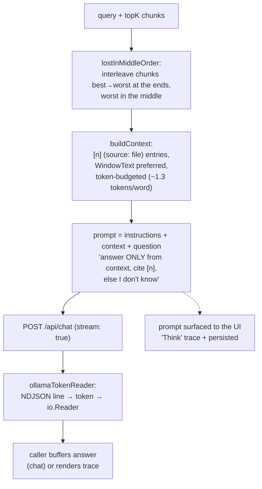

Decisions:

- **Lost-in-the-middle reordering** places the highest-ranked chunks at the
  prompt edges where small models attend best; the interleave order is
  deterministic (front/back alternation over the score-sorted list).
- **Word-based token estimation** (`~1.3 tokens/word`) budgets context under
  `max_context_tokens` (default 2800 ≈ 70% of a 4k window) and truncates the
  last entry at a word boundary rather than dropping it.
- **The exact prompt is returned alongside the stream.** Callers surface it
  as the UI's "Think" trace and persist it with the turn, without rebuilding
  prompt logic.
- **Grounding is prompt-enforced** ("ONLY the context below", explicit
  fallback sentence, inline `[n]` citations mapped to the numbered entries).

### Alternatives considered

- *Function-calling / tool-use loop with the LLM driving retrieval* —
  rejected for now: one-shot retrieve-then-generate is predictable, cheap,
  and fits the 1B model class.
- *Streaming to the client* — deferred; see chat RFC open questions.

---

## Index-Time LLM Enrichment (HyPE + Contextual Retrieval)

### Motivation

Two published techniques improve recall by changing *what gets indexed*
rather than *how it is searched* — both cost one-time LLM work per chunk at
ingest and add zero query-time latency:

- **HyPE** (hypothetical prompt embeddings): index N hypothetical questions
  per chunk so retrieval becomes question-to-question matching.
- **Contextual retrieval** (Anthropic-style): prepend a short LLM-written
  situational intro to each chunk before embedding.

### Design

Both are implemented in `internal/enrichment` (an `Enricher` over Ollama
chat, non-streaming, temperature 0.2, lenient JSON parsing) and consumed by
the ingest pipeline behind feature flags, default **off**:

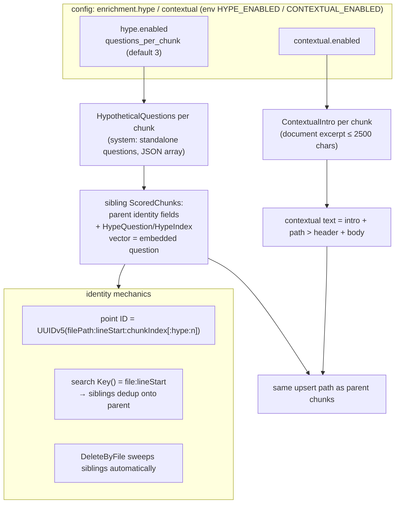

Enrichment address/model fall back through a chain resolved at wiring time:
`enrichment.*.ollama_addr → generator.ollama_addr → embedder.ollama_addr`,
and `enrichment.*.model → generator.model`.

Rules:

- **Graceful per-chunk degradation.** A failed intro or question set logs a
  warning and indexes the chunk un-enriched; HyPE failures never fail a file.
- **Siblings share the parent's payload identity** so search-side `Key()`
  dedup collapses them onto the parent chunk while point IDs stay unique
  (`:hype:<n>` suffix). `DeleteByFile` removes them with the parent.
- **Enabling requires a reindex** — both change the index, not the query
  path.

### Measured status

A/B on the toy corpus was neutral-to-slightly-negative (clean tiny corpus,
`gemma3:1b` question noise); paper gains (~+20pp precision) appear on
fragmented/larger corpora. Flags stay off until a real corpus exists.

---

## History Persistence

### Motivation

Conversations should survive restarts and be replayable, without new
infrastructure.

### Design

`internal/history` stores sessions and turns in a Qdrant collection
(`chat_history`) reusing the shared gRPC connection and embedder:

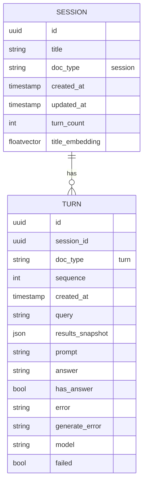

- Sessions and turns are separate points in one collection, discriminated by
  a `doc_type` payload keyword. Each point carries a vector: sessions embed
  their title, turns embed their query (for future semantic search over
  either).
- Session listing scrolls `doc_type=session` ordered by `updated_at` desc;
  turn replay scrolls `doc_type=turn AND session_id=<id>` ordered by
  `sequence` asc.
- `AppendTurn` updates the session's `turn_count`/`updated_at` via
  `SetPayload` (no re-upsert, so the session's vector isn't re-supplied) and
  creates the session on the fly with the first-turn title as a defensive
  fallback.
- `DeleteSession` removes a session and all its turns; the API exposes it as
  `DELETE /history/sessions/:id`.
- `DeleteSession` removes a session and all its turns; the API exposes it as
  `DELETE /history/sessions/:id`.
- Replay renders persisted turns through the same `turnView` mapping as live
  turns, so templates don't distinguish live from replayed data. Relative
  score bars are recomputed at render time (RRF and reranker scores have
  different ranges, so bars are scaled to the turn's top score).

---

## Configuration and Feature Gates

### Motivation

One deployment must serve local dev (localhost Ollama/Qdrant) and Docker
(env-overridden hostnames), and users must be able to see and flip what's
running without reading Go.

### Design

`config/config.yaml` → `config.Load` → `applyEnv()` → `Validate()`. Env vars
win over YAML; validation applies defaults for derived values
(`prefetch_mul` = 5, reranker model, HyPE question count, history collection
name).

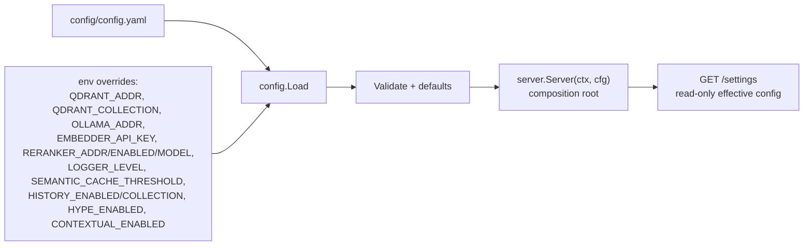

Feature matrix:

| Feature | Config | Default | Requires | Degradation when off/unreachable |
|---------|--------|---------|----------|----------------------------------|
| Answer generation | `generator.enabled` | on | Ollama LLM | turns return retrieval-only |
| Semantic cache | `semantic_cache.enabled` | on | — (reuses Qdrant) | every query searches fresh |
| Reranker | `reranker.enabled` | on | sidecar :5002 | fused candidates, un-reranked |
| HyPE | `enrichment.hype.enabled` | off | Ollama LLM + reindex | no question siblings |
| Contextual retrieval | `enrichment.contextual.enabled` | off | Ollama LLM + reindex | static path/header prefix only |
| Chat history | `history.enabled` | on | — (reuses Qdrant) | stateless chat, empty sidebar |
| Sentence-window chunking | `chunker.provider` | recursive | reindex | recursive chunking |

Address fallback chains (resolved at wiring, not per-call):

- generator/enrichment ollama_addr: own → `embedder.ollama_addr`
- enrichment model: own → `generator.model`

Local vs Docker: `./scripts/local.sh` runs the host server straight against
localhost addresses from config; `docker-compose.yml` overrides via env
(Qdrant `qdrant:6334`, reranker `reranker:5002`, Ollama `host.docker.internal:11434`).

---

## Evaluation Harness

### Motivation

Retrieval changes (reranker model swaps, prefixes, enrichment flags) must be
measured, not vibes-approved, and A/B-compared against a fixed golden set.

### Design

`cmd/evalbench` (CLI) + `internal/eval` (domain):

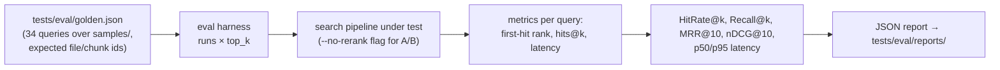

- `--ensure-ingest` guarantees the corpus is indexed before measuring;
  `--runs N` repeats queries for latency percentiles.
- Relevance judging is binary (expected chunk present at rank), matching the
  small-model use case.
- Reports accumulate under `tests/eval/reports/` for before/after diffs; the
  measured table in TODO.md is the canonical scoreboard.

Current measured baseline (top_k=5, 34 queries): bge-reranker-v2-m3 +
nomic prefixes + aligned BM25 reaches HitRate@5 0.882, MRR@10 0.824,
nDCG@5 0.857 — at ~3.2s p50 rerank latency, which motivates the quantization
work under open questions.

---

## API Conventions

### Motivation

The same endpoints serve curl (JSON) and the htmx UI (fragments); handlers
must pick the response shape from the request, not the route.

### Design

- **Content negotiation by `HX-Request: true`**: `/ingest` returns the
  attachment-chip fragment for htmx, JSON otherwise. `/retrieval/search`
  always returns a turn fragment (it is UI-native).
- **Session handoff via headers**: `X-Nadir-Session-Id` (minted id) and
  `HX-Trigger: nadir:turn-appended` (drives sidebar refresh).
- **One fragment per interaction**: each exchange appends exactly one "turn"
  fragment; the page shell renders once with the composer and sidebar.
- **Filters are optional form fields**: `file_path`, `header`, `source_sha`
  map to a `store.SearchFilter` (exact keyword matches on payload indexes).
- **Attached files are display-only**: the `attached_files` field names files
  imported just before the message; they were already ingested at import time
  and do not scope the search.

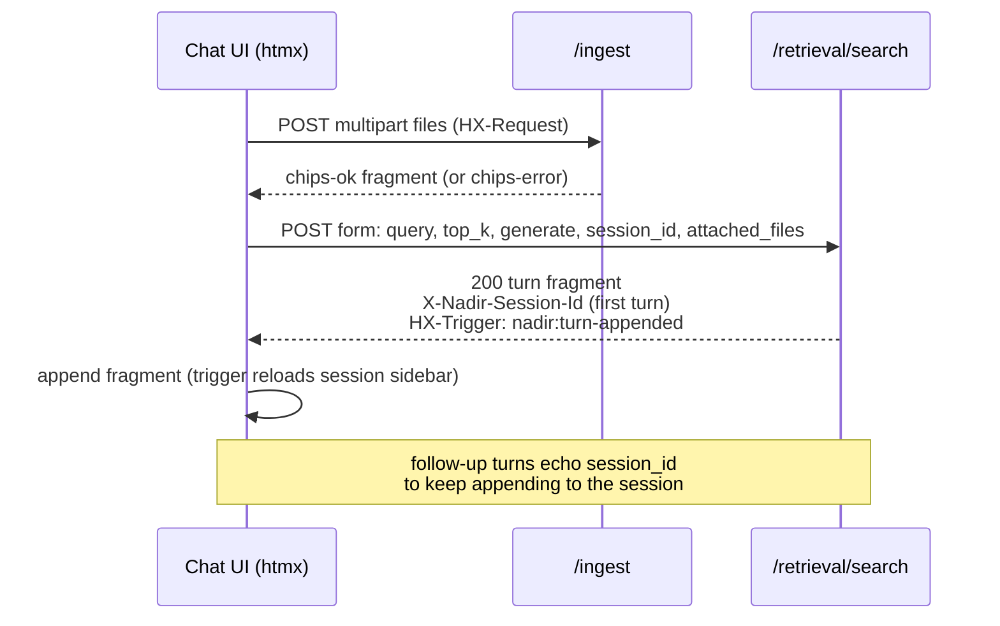

---

## Glossary

| Term | Meaning |
|------|---------|
| **Chunk** | One retrievable text unit; carries file path, header, line range, optional window text |
| **Contextual text** | `filePath > header\nbody` — the identity-prefixed string both retrieval legs index |
| **HyPE sibling** | An indexed hypothetical question sharing its parent chunk's identity fields; point ID suffixed `:hype:<n>` |
| **RRF** | Reciprocal Rank Fusion; Qdrant-side merge of dense and BM25 prefetch legs |
| **`Key()`** | `file_path:line_start` — search-side dedup key collapsing HyPE siblings onto parents |
| **Fragment (UI)** | An htmx HTML partial rendered into the page (turn, chips, session list) |
| **Fragment (query)** | One sentence of a multi-sentence query, searched independently |
| **Turn** | One question/answer exchange: query, retrieved results, optional generated answer, errors |
| **Golden set** | `tests/eval/golden.json` — fixed queries with expected relevance for evalbench |
